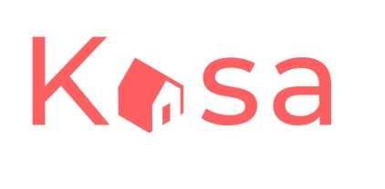

<h1 align="center">
</h1>

# **[https://kasa-dylannicolet.netlify.app/](https://kasa-dylannicolet.netlify.app/)**

<h3 align="center">An apartment rental website</h3>
</h1>

>## **In a few words**
This website coded in React will allow users to explore apartments from our database, read about their attributes and view images of said apartements.

>## **Developement technologies used**
* Create React App for the front-end
* React Router for navigation through the site
* SASS for styling
* No React external libraries should be used

>## **Key requirements for the project and a visual of the live results**
1. The photo gallery component should cycle thought the images indefinitly where clicking the next button on the last image will bring us to the first image and vis-versa.

2. Information collapses should all be closed by default to open and close on user click.

3. If a false url is used, the user should be redirected to the Error page.

>## **Learning goals of this project**
* Create a complete website with React
* Understand and implement React Router properly
* Learn to create functional react components that are re-useable.

>## **Challenges faced**
* Properly integrating React Router and covering all possible user inputs

>## **Goals achieved?**

Absolutely 100%

